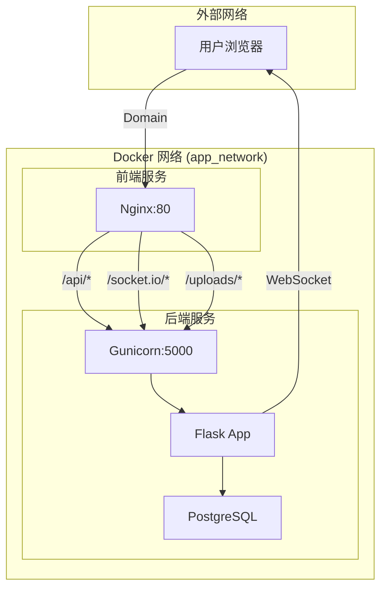

# MyWebsite - 全栈个人网站项目

一个现代化的全栈个人网站项目，采用前后端分离架构，基于 Docker Compose 部署。包含个人博客、作品展示、技能展示、联系方式管理等功能，并配备完整的管理后台。

## 🚀 项目特性

### 核心技术栈
- **后端**: Python Flask + SQLAlchemy + JWT 认证
- **前端**: React 19 + Vite + Material-UI
- **数据库**: PostgreSQL
- **部署**: Docker Compose + Nginx
- **实时通信**: Socket.IO WebSocket

### 主要功能
- 📝 博客文章管理系统（支持 Markdown）
- 🎨 个人作品展示
- 💼 技能标签管理  
- 📞 联系方式管理
- 👥 用户评论系统（带智能限制）
- 🔐 完整的后台管理系统
- 🌐 响应式设计，支持移动端
- ⚡ 实时数据更新（WebSocket）

## 📦 项目结构

```
MyWebsite/
├── backend/                 # Flask 后端服务
│   ├── models/             # 数据模型
│   ├── routes/             # API 路由
│   ├── services/          # 业务逻辑服务
│   ├── utils/             # 工具函数
│   ├── app.py             # 应用入口
│   ├── config.py          # 配置管理
│   ├── Dockerfile         # 后端容器配置
│   └── pyproject.toml     # Python 依赖配置
├── frontend/               # React 前端应用
│   ├── src/
│   │   ├── admin/         # 管理后台
│   │   ├── components/    # 公共组件
│   │   ├── config/        # 配置管理
│   │   ├── hooks/         # React Hooks
│   │   ├── theme/         # 主题配置
│   │   └── utils/         # 工具函数
│   ├── Dockerfile         # 前端容器配置
│   ├── nginx.conf         # Nginx 配置
│   └── package.json       # Node.js 依赖
├── docker-compose.yml     # Docker 编排配置
└── README.md             # 项目说明文档
```

## 🛠️ 快速开始

### 环境要求
- Docker 20.10+
- Docker Compose 2.0+
- PostgreSQL (可通过 Docker 运行)

### 1. 克隆项目
```bash
git clone <your-repo-url>
cd MyWebsite
```

### 2. 配置环境变量
复制后端环境变量模板：
```bash
cp backend/.env.example backend/.env
```

编辑 `backend/.env` 文件，配置数据库连接和其他设置：
```env
# 数据库配置
DB_HOST=host.docker.internal
DB_PORT=5432
DB_USER=postgres
DB_PASSWORD=your_password
DB_NAME=mywebsite

# 安全配置
SECRET_KEY=your-secret-key-change-in-production
JWT_SECRET_KEY=your-jwt-secret-change-in-production

# 管理员账号
ADMIN_USERNAME=admin
ADMIN_PASSWORD=admin123

# 其他配置...
```

### 3. 启动服务
```bash
# 使用 Docker Compose 启动所有服务
docker-compose up -d

# 查看服务状态
docker-compose ps

# 查看日志
docker-compose logs -f
```

### 4. 访问应用
- **前端应用**: http://localhost:4419
- **管理后台**: http://localhost:4419/admin
- **API 文档**: http://localhost:5000/api

## 🔧 开发模式

### 后端开发
```bash
cd backend

# 安装 Python 依赖（使用 uv）
uv pip install -e .

# 启动开发服务器
python app.py --debug
```

### 前端开发
```bash
cd frontend

# 安装依赖
npm install

# 启动开发服务器
npm run dev
```

## 📊 技术架构

### 后端架构
- **Web 框架**: Flask 3.1.2
- **ORM**: SQLAlchemy 3.1.1
- **认证**: JWT Extended 4.7.1
- **实时通信**: Socket.IO 5.5.1
- **任务调度**: APScheduler 1.13.1
- **包管理**: uv (现代 Python 包管理器)

### 前端架构
- **框架**: React 19.0.0
- **构建工具**: Vite 6.2.0
- **UI 组件库**: Material-UI 6.4.7
- **路由**: React Router 7.0.0
- **HTTP 客户端**: Axios 1.6.0
- **状态管理**: React Hooks
- **Markdown 渲染**: React Markdown + rehype/remark

### 数据库设计
- **文章管理** (Article): 博客文章、分类、标签
- **技能管理** (Skill): 技术技能展示
- **联系方式** (Contact): 多种联系方式
- **评论系统** (Comment): 用户评论和回复
- **站点内容** (SiteBlock): 可配置的站点内容块
- **头像管理** (Avatar): 用户头像管理

## 🌐 网络架构



### 端口映射
- **前端**: 主机 4419 → 容器 80 (Nginx)
- **后端**: 内部网络通信 (不直接暴露)

### 服务发现
- 前端通过服务名 `backend` 访问后端 API
- 后端数据库连接通过环境变量配置

## ⚙️ 配置说明

### 环境变量配置
项目支持通过环境变量配置所有关键参数：

| 变量名 | 描述 | 默认值 |
|--------|------|--------|
| `DB_HOST` | 数据库主机 | `localhost` |
| `DB_PORT` | 数据库端口 | `5432` |
| `DB_USER` | 数据库用户 | `postgres` |
| `DB_PASSWORD` | 数据库密码 | `password` |
| `DB_NAME` | 数据库名称 | `mywebsite` |
| `SECRET_KEY` | Flask 密钥 | 随机生成 |
| `JWT_SECRET_KEY` | JWT 密钥 | 随机生成 |
| `UPLOAD_FOLDER` | 文件上传目录 | `uploads` |

### Nginx 配置
- 静态文件缓存优化
- Gzip 压缩启用
- API 请求代理到后端
- WebSocket 支持配置
- 文件上传大小限制

## 🚢 部署说明

### 生产环境部署
1. **设置强密码**: 修改所有默认密码和密钥
2. **配置 SSL**: 添加 HTTPS 支持
3. **数据库备份**: 设置定期备份策略
4. **监控日志**: 配置日志监控和告警
5. **资源限制**: 设置容器资源限制

### 扩展性考虑
- 可以轻松扩展为多实例部署
- 支持负载均衡配置
- 数据库读写分离支持
- 静态文件 CDN 加速

## 🐛 故障排除

### 常见问题

1. **数据库连接失败**
   ```bash
   # 检查 PostgreSQL 服务状态
   docker-compose logs backend
   ```

2. **端口冲突**
   ```bash
   # 修改 docker-compose.yml 中的端口映射
   ports:
     - "4420:80"  # 修改前端端口
   ```

3. **文件权限问题**
   ```bash
   # 确保上传目录有正确权限
   chmod -R 755 backend/uploads
   ```

4. **环境变量未生效**
   ```bash
   # 重新启动服务
   docker-compose down && docker-compose up -d
   ```

### 日志查看
```bash
# 查看所有服务日志
docker-compose logs

# 查看特定服务日志
docker-compose logs backend
docker-compose logs frontend

# 实时日志跟踪
docker-compose logs -f backend
```

## 📝 API 文档

项目提供完整的 RESTful API 接口：

### 认证相关
- `POST /api/auth/login` - 用户登录
- `POST /api/auth/logout` - 用户登出
- `GET /api/auth/refresh` - 刷新 Token

### 文章管理
- `GET /api/articles` - 获取文章列表
- `POST /api/articles` - 创建新文章
- `GET /api/articles/{id}` - 获取文章详情
- `PUT /api/articles/{id}` - 更新文章
- `DELETE /api/articles/{id}` - 删除文章

### 评论系统
- `GET /api/comments` - 获取评论列表
- `POST /api/comments` - 创建评论
- `DELETE /api/comments/{id}` - 删除评论

### 其他接口
- `GET /api/skills` - 获取技能列表
- `GET /api/contacts` - 获取联系方式
- `POST /api/upload` - 文件上传

## 🤝 贡献指南

1. Fork 本项目
2. 创建特性分支 (`git checkout -b feature/AmazingFeature`)
3. 提交更改 (`git commit -m 'Add some AmazingFeature'`)
4. 推送到分支 (`git push origin feature/AmazingFeature`)
5. 开启 Pull Request

## 📄 许可证

本项目采用 MIT 许可证 - 查看 [LICENSE](LICENSE) 文件了解详情。

---

**如有问题，请提交 [Issue](https://github.com/your-repo/issues) 或通过联系方式与我们联系。**
